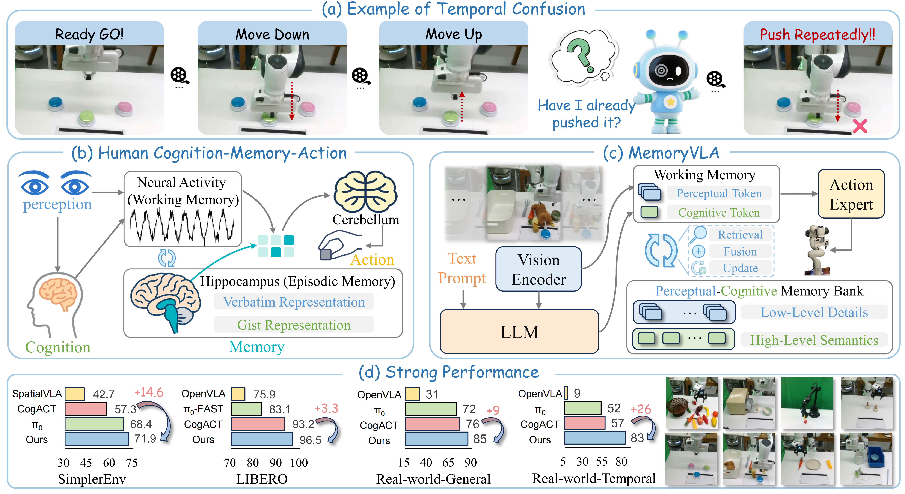

# MemoryVLA: Perceptual-Cognitive Memory in Vision-Language-Action Models for Robotic Manipulation
[Hao Shi](https://shihao1895.github.io/), [Bin Xie](https://xb534.github.io/), [Yingfei Liu](https://scholar.google.com/citations?user=pF9KA1sAAAAJ), [Lin Sun](https://github.com/linsun449), [Fengrong Liu](https://shihao1895.github.io/MemoryVLA/) [Tiancai Wang](https://scholar.google.com/citations?user=YI0sRroAAAAJ), [Erjin Zhou](https://scholar.google.com/citations?user=k2ziPUsAAAAJ), [Haoqiang Fan](https://scholar.google.com/citations?user=bzzBut4AAAAJ), [Xiangyu Zhang](https://scholar.google.com/citations?user=yuB-cfoAAAAJ), [Gao Huang](https://scholar.google.com/citations?user=-P9LwcgAAAAJ)

Tsinghua University, Dexmal, MEGVII, TJU, HiT, StepFun

ICLR 2026

> This is the code for the paper "MemoryVLA: Perceptual-Cognitive Memory in Vision-Language-Action Models for Robotic Manipulation".

### 🏠[MemoryVLA Project](https://shihao1895.github.io/MemoryVLA) | 🏠[MemoryVLA++ Project](https://shihao1895.github.io/MemoryVLA-PP-Web) | 📑[Paper](https://arxiv.org/abs/2508.19236) | 🤗[Models & Logs](https://huggingface.co/collections/shihao1895/memoryvla)

## 🌟 News

- 🔥 [2026-6-9] Extended journal version [MemoryVLA++](https://shihao1895.github.io/MemoryVLA-PP-Web) is available!
- 🔥 [2026-1-27] Our paper [MemoryVLA](https://arxiv.org/abs/2508.19236) is accepted by ICLR 2026!
- 🔥 [2025-11-5] The code of [MemoryVLA](https://arxiv.org/abs/2508.19236) is released! (Both MemoryVLA and MemoryVLA+)
- 🔥 [2025-10-20] Our VLA codebase [Dexbotic](https://github.com/Dexmal/dexbotic) is released, it now fully integrates MemoryVLA !
- 🔥 [2025-8-26] Our paper [MemoryVLA](https://arxiv.org/abs/2508.19236) is now on arxiv!

## Overview

MemoryVLA is a Cognition-Memory-Action framework for robotic manipulation inspired by human memory systems. It builds a hippocampal-like perceptual-cognitive memory to capture the temporal dependencies essential for current decision-making, enabling long-horizon, temporally aware action generation.



We release three versions of the code in separate branches:

- **[MemoryVLA](https://github.com/shihao1895/MemoryVLA/tree/openvla-codebase)**:  built upon the OpenVLA codebase.
- **[MemoryVLA+](https://github.com/shihao1895/MemoryVLA/tree/dexbotic-codebase)**:  built upon our self-developed [Dexbotic](https://dexbotic.com) codebase, which offers higher simulation performance.
- **MemoryVLA++**:  extended journey version of MemoryVLA.

## TODO

All components of MemoryVLA are now available, and MemoryVLA++ will be released in the coming months.

- [x] MemoryVLA (OpenVLA codebase)
  - [x] Code Release
  - [x] Model Weights Release
  - [x] Dataset Upload to HuggingFace

- [x] MemoryVLA+ (Dexbotic codebase)
- [ ] MemoryVLA++ (Extended Journey Version)
  - [ ] Code Release
  - [ ] Model Weights Release
  - [ ] Dataset Upload to HuggingFace


## Contents

This is MemoryVLA based on OpenVLA codebase, **if you need use dexbotic codebase**, please use [MemoryVLA+](https://github.com/shihao1895/MemoryVLA/tree/dexbotic-codebase).

 * [**Model Zoo & Benchmark Results**](#Model-Zoo-&-Benchmark-Results)
 * [**Install**](#Install)
 * [**Evaluation in Libero**](#Evaluation-in-Libero)
 * [**Evaluation in SimplerEnv**](#Evaluation-in-SimplerEnv)
 * [**Training**](#Training)
 * [**Deployment in The Real World**](#deployment-in-the-real-world)
 * [**FAQ**](#FAQ)
 * [**Citation**](#Citation)

## Model Zoo & Benchmark Results

> MemoryVLA means openvla-codebase version, MemoryVLA+ means dexbotic-codebase version.

### Libero

| Model            | Spatial | Object | Goal | Long-10 | Long-90 | Avg. | CKPT & Logs                                                  |
| ---------------- | ------- | ------ | ---- | ------- | ------- | ---- | ------------------------------------------------------------ |
| MemoryVLA        | 98.4    | 98.4   | 96.4 | 93.4    | 95.6    | 96.5 | [🤗 Spa](https://huggingface.co/shihao1895/memvla-libero-spatial), [🤗 Obj](https://huggingface.co/shihao1895/memvla-libero-object), [🤗 Goal](https://huggingface.co/shihao1895/memvla-libero-goal), [🤗 100](https://huggingface.co/shihao1895/memvla-libero-100) |
| MemoryVLA+       | 98.2    | 97.8   | 96.4 | 93.6    | 96.2    | 96.5 | [🤗 Spa](https://huggingface.co/shihao1895/memvla-plus-libero-spatial), [🤗 Obj](https://huggingface.co/shihao1895/memvla-plus-libero-object), [🤗 Goal](https://huggingface.co/shihao1895/memvla-plus-libero-goal), [🤗 100](https://huggingface.co/shihao1895/memvla-plus-libero-100) |
| MemoryVLA+ (mix) | 97.2    | 99.2   | 98.4 | 93.2    | 97.2    | 97.1 | [🤗 HF](https://huggingface.co/shihao1895/memvla-plus-libero-mix) |
| MemoryVLA++      | 99.8    | 100.0  | 98.2 | 96.0    | 97.8    | 98.4 | TBD                                                          |

### SimplerEnv-Bridge

| Model       | Spoon | Carrot | Cube | Eggplant | Avg. | CKPT & Logs                                                  |
| ----------- | ----- | ------ | ---- | -------- | ---- | ------------------------------------------------------------ |
| MemoryVLA   | 75.0  | 75.0   | 37.5 | 100.0    | 71.9 | [🤗 HF](https://huggingface.co/shihao1895/memvla-bridge)      |
| MemoryVLA+  | 100.0 | 66.7   | 70.8 | 100.0    | 84.4 | [🤗 HF](https://huggingface.co/shihao1895/memvla-plus-bridge) |
| MemoryVLA++ | 83.3  | 66.7   | 45.8 | 100.0    | 73.9 | TBD                                                          |

### Mikasa-Robo

| Model       | SGT  | IM   | RC3  | RC5  | RC9  | Avg. | CKPT & Logs                                             |
| ----------- | ---- | ---- | ---- | ---- | ---- | ---- | ------------------------------------------------------- |
| MemoryVLA   | 88   | 24   | 44   | 30   | 20   | 41.2 | [🤗 HF](https://huggingface.co/shihao1895/memvla-mikasa) |
| MemoryVLA++ | 97   | 40   | 50   | 19   | 16   | 44.4 | TBD                                                     |

### Libero-Plus

| Model             | Cam  | Robo | Lang | Light | Backg | Noi  | Layout | Avg. | CKPT & Logs |
| ----------------- | ---- | ---- | ---- | ----- | ----- | ---- | ------ | ---- | ----------- |
| MemoryVLA         | 42.7 | 44.9 | 84.4 | 92.8  | 95.0  | 62.1 | 84.7   | 70.2 | TBD         |
| MemoryVLA++       | 36.4 | 68.9 | 88.7 | 93.8  | 90.6  | 63.5 | 83.8   | 73.1 | TBD         |
| MemoryVLA (SFT)   | 91.4 | 48.6 | 79.4 | 95.2  | 95.3  | 94.0 | 75.7   | 81.9 | TBD         |
| MemoryVLA++ (SFT) | 96.8 | 49.7 | 71.0 | 96.6  | 97.0  | 96.0 | 78.6   | 82.7 | TBD         |

### Calvin

| Model       | 1    | 2    | 3    | 4    | 5    | Avg. | CKPT & Logs |
| ----------- | ---- | ---- | ---- | ---- | ---- | ---- | ----------- |
| MemoryVLA   | 94.8 | 87.4 | 81.4 | 75.9 | 69.4 | 4.09 | TBD         |
| MemoryVLA++ | 95.6 | 90.2 | 85.7 | 81.7 | 76.1 | 4.29 | TBD         |

### Fractal-VM

| Model      | Coke Can | Move Near | Open/Close Drawer | Put In Drawer | Avg. | CKPT & Logs                                                  |
| ---------- | -------- | --------- | ----------------- | ------------- | ---- | ------------------------------------------------------------ |
| MemoryVLA  | 90.7     | 88.0      | 84.7              | 47.2          | 77.7 | [🤗 HF](https://huggingface.co/shihao1895/memvla-fractal)     |
| MemoryVLA+ | 92.0     | 91.7      | 71.8              | -             | -    | [🤗 HF](https://huggingface.co/shihao1895/memvla-plus-fractal) |

### Fractal-VA

| Model      | Coke Can | Move Near | Open/Close Drawer | Put In Drawer | Avg. | CKPT & Logs                                                  |
| ---------- | -------- | --------- | ----------------- | ------------- | ---- | ------------------------------------------------------------ |
| MemoryVLA  | 80.5     | 78.8      | 53.2              | 58.3          | 67.7 | [🤗 HF](https://huggingface.co/shihao1895/memvla-fractal)     |
| MemoryVLA+ | 83.5     | 81.8      | 63.2              | -             | -    | [🤗 HF](https://huggingface.co/shihao1895/memvla-plus-fractal) |

### Maniskill2

| Model      | Pick Cube | Stack Cube | Pick Single YCB | Pick Single EGAD | Pick Clutter YCB | Avg. | CKPT & Logs                                                  |
| ---------- | --------- | ---------- | --------------- | ---------------- | ---------------- | ---- | ------------------------------------------------------------ |
| MemoryVLA+ | 85        | 75         | 60              | 85               | 45               | 70   | [🤗 HF](https://huggingface.co/shihao1895/memvla-plus-maniskill2) |

## Install

The code is built using Python 3.10, and we use PyTorch == 2.2.0 and CUDA == 12.1 (It may run with lower versions, but we have not tested it).

We recommend using [Miniconda](https://docs.conda.io/en/latest/miniconda.html) and setting up an environment:
```bash
conda create --name memvla python=3.10
conda activate memvla

pip install torch==2.2.0 torchvision==0.17.0 torchaudio==2.2.0 --index-url https://download.pytorch.org/whl/cu121
conda install -c nvidia cuda-nvcc=12.1 cuda-toolkit=12.1 -y
```
If you need to use the traning code, please also install the [Flash Attention](https://github.com/Dao-AILab/flash-attention), we use flash-attn==2.5.5:

```bash
# Install Flash Attention 2.5.5, this is an example for pytorch2.2-cuda12.1
wget https://github.com/Dao-AILab/flash-attention/releases/download/v2.5.5/flash_attn-2.5.5+cu122torch2.2cxx11abiFALSE-cp310-cp310-linux_x86_64.whl
pip install flash_attn-2.5.5+cu122torch2.2cxx11abiFALSE-cp310-cp310-linux_x86_64.whl
```

Next, clone our repo and install the required packages:

```bash
git clone https://github.com/shihao1895/MemoryVLA
cd MemoryVLA
pip install -e .
```
If you are using an NVIDIA Hopper GPU (e.g., H20) and encounter the error  
“Floating point exception (core dumped)”, try reinstalling the specific cuBLAS version below:

```bash
# Fix for NVIDIA H20: "Floating point exception (core dumped)"
pip install nvidia-cublas-cu12==12.4.5.8
```

## Evaluation in Libero

We also provide evaluation interfaces and scripts based on [LIBERO](https://libero-project.github.io/intro.html).

1. Please follow the installation guide in the [LIBERO Repo](https://github.com/Lifelong-Robot-Learning/LIBERO) to set up the simulation environment, and make sure to place the repo under: `./third_libs/LIBERO`

2. Evaluation Example.

   ```bash
   # Run evaluation
   bash script/eval/libero/eval_libero.sh
   # Summarize results
   python script/eval/libero/extract_libero_results.py
   ```

   > **NOTE:** The evaluation mechanism here is different from SimplerEnv. The process first loads the model using `develop.py`, then waits for a period before running `evaluation/libero/eval_libero.py` for testing. In addition, since performance may vary across iterations, please evaluate multiple checkpoints and report the best result.

## Evaluation in SimplerEnv

We provide evaluation interfaces and scripts based on [SimplerEnv](https://simpler-env.github.io/).

1. Please follow the installation guide in the [SimplerEnv Repo](https://github.com/simpler-env/SimplerEnv) to set up the simulation environment, and make sure to place the repo under: `./third_libs/SimplerEnv`

2. Evaluation Example.

   ```bash
   # Run evaluation
   bash script/eval/bridge/eval_bridge.sh
   # Summarize results
   python script/eval/bridge/extract_bridge_results.py
   ```

   > **NOTE**: Due to the instability of the SimplerEnv benchmark and diffusion process, the performance scores across different iterations can vary significantly. Please evaluate checkpoints **every 2.5k steps** and report the best result.

## Training

1. Prepare training dataset with [RLDS](https://github.com/google-research/rlds) format:

   - [LIBERO](https://libero-project.github.io/intro.html) (including Spatial, Object, Goal, Long-10, Long-90 suites)
   - Bridge from [Open X-Embodiment (OXE)](https://robotics-transformer-x.github.io/)
   - Fractal from [Open X-Embodiment (OXE)](https://robotics-transformer-x.github.io/)

   ```bash
   # Make sure you have git-lfs installed (https://git-lfs.com)
   git lfs install
   # Download the LIBERO dataset (processed, ~22 GB)
   git clone https://huggingface.co/datasets/shihao1895/libero-rlds
   # Download the Bridge dataset (processed, ~157 GB)
   git clone https://huggingface.co/datasets/shihao1895/bridge-rlds
   # Download the Fractal dataset (processed)
   git clone https://huggingface.co/datasets/shihao1895/fractal-rlds
   ```

2. Download pretrained model, we use [OpenVLA Pretrained Model](https://huggingface.co/openvla/openvla-7b-prismatic) for LIBERO training, and [CogACT Pretrained Model](https://huggingface.co/CogACT/CogACT-Large) for Bridge and Fractal training.

   ```bash
   # Download OpenVLA pretrained checkpoint (~30 GB)
   git clone https://huggingface.co/openvla/openvla-7b-prismatic
   
   # Download CogACT pretrained checkpoint (~31 GB)
   git clone https://huggingface.co/CogACT/CogACT-Large
   ```

3. Train the model on different datasets

   Before training, modify several parameters in the corresponding scripts, such as `hf_token`, `wandb_entity`, checkpoint paths, dataset paths, and log directories.

   We train on a single node with 8× NVIDIA A100 GPUs.

   ```bash
   # Train on the Bridge dataset
   bash script/train/bridge/train_bridge.sh
   # Train on the LIBERO-Spatial dataset
   bash script/train/libero/train_libero_spatial.sh
   # Train on the LIBERO-Object dataset
   bash script/train/libero/train_libero_object.sh
   # Train on the LIBERO-Goal dataset
   bash script/train/libero/train_libero_goal.sh
   # Train on the LIBERO-100 dataset
   bash script/train/libero/train_libero_100.sh
   # Train on the Fractal dataset
   bash script/train/fractal/train_fractal.sh
   # Train on real-world data
   bash script/train/real_world/train_real.sh
   ```

   To finetune on your own customized data, please follow the instruction [(rlds_dataset_builder)](https://github.com/kpertsch/rlds_dataset_builder) for converting your data to RLDS format. The actions should be the deltas of end effector ``EEF Delta XYZ (3) + Roll-Pitch-Yaw (3) + Gripper Open/Close (1)``. Once your customized data is ready, place the customized data directly under the ``<data_root_dir>/custom_finetuning/1.0.0`` directory. Then set ``vla.data_mix="custom_finetuning"``.

## Deployment in the Real World

To deploy the model on your own robot, first collect corresponding real-world manipulation data (e.g., via teleoperation), and use it to fine-tune the pretrained model.

Next, set up the server and client as shown in [`deploy.py`](deploy.py), and deploy the system on your real robot.

The following command launches the server:
```bash
bash script/eval/real_world/deploy.sh
```

The robot acts as the client, and for each request it must send the following three items to obtain the action chunking result. The field episode_first_frame is a string ('True' or 'False') indicating whether the current frame is the first frame of the episode.

```bash
image = request.files['image']
query = request.form['text']
episode_first_frame = request.form['episode_first_frame']
```

This deployment process follows a similar design to [OpenVLA](https://github.com/openvla/openvla) and [CogACT](https://github.com/microsoft/CogACT).

## FAQ

SimplerEnv and ManiSkill may involve several dependency issues during installation. Below are some common troubleshooting tips based on our experience.

**(1) Vulkan / SAPIEN issues**  
Example errors:
ImportError: libvulkan.so.1: cannot open shared object file: No such file or directory
Some required Vulkan extension is not present. You may not use the renderer to render, however, CPU resources will be still available.

Fix:

```bash
sudo apt install -y libegl1-mesa libgl1-mesa-dev libgles2-mesa-dev
```

and reference:
https://maniskill.readthedocs.io/en/latest/user_guide/getting_started/installation.html#troubleshooting

> **Note**: Check that the .json files correctly link to the .so file corresponding to your current NVIDIA driver version. Use `nvidia-smi` to check your driver version and locate the correct .so under /usr/lib/x86_64-linux-gnu/.

**(2) OpenGL issues**  
Example errors:
ImportError: libGL.so.1: cannot open shared object file: No such file or directory

Fix:

```bash
sudo apt install -y libgl1 libglib2.0-0 libglx-mesa0 libopengl0 libglu1-mesa mesa-utils
```

**(3) Video recording in SimplerEnv**

```bash
sudo apt install -y ffmpeg
```

(4) **Benchmark Score Fluctuations**

Benchmark scores may fluctuate across training iterations, with particularly large variations observed on SimplerEnv. We therefore recommend **evaluating checkpoints at regular iteration intervals and reporting the best result**. In addition, even minor differences in Conda package versions may lead to variations in the scores.

## Citation

If you find our work helpful in your research, please consider citing [our paper](https://arxiv.org/abs/2508.19236). 

```bibtex
@article{shi2025memoryvla,
  title={MemoryVLA: Perceptual-Cognitive Memory in Vision-Language-Action Models for Robotic Manipulation},
  author={Shi, Hao and Xie, Bin and Liu, Yingfei and Sun, Lin and Liu, Fengrong and Wang, Tiancai and Zhou, Erjin and Fan, Haoqiang and Zhang, Xiangyu and Huang, Gao},
  journal={arXiv preprint arXiv:2508.19236},
  year={2025}
}

@article{shi2026memoryvla++,
  title={MemoryVLA++: Temporal Modeling via Memory and Imagination in Vision-Language-Action Models},
  author={Shi, Hao and Li, Weiye and Xie, Bin and Wang, Yulin and Zhou, Renping and Wang, Tiancai and Zhang, Xiangyu and Luo, Ping and Huang, Gao},
  journal={arXiv preprint arXiv:2606.09827},
  year={2026}
}

@article{dexbotic,
  title={Dexbotic: Open-Source Vision-Language-Action Toolbox},
  author={Dexbotic Contributors},
  journal={arXiv preprint arXiv:2510.23511},
  year={2025}
}
```

